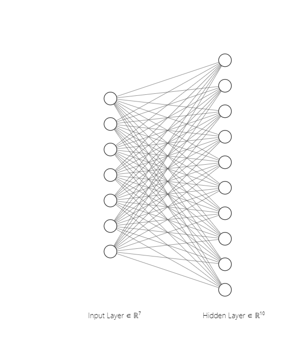
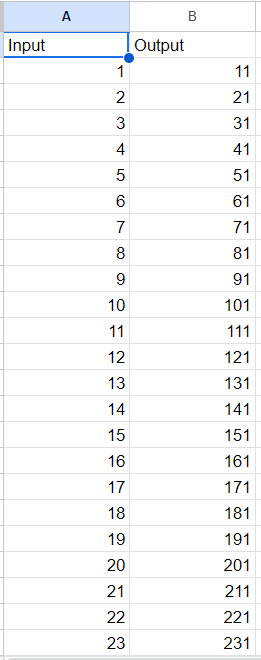
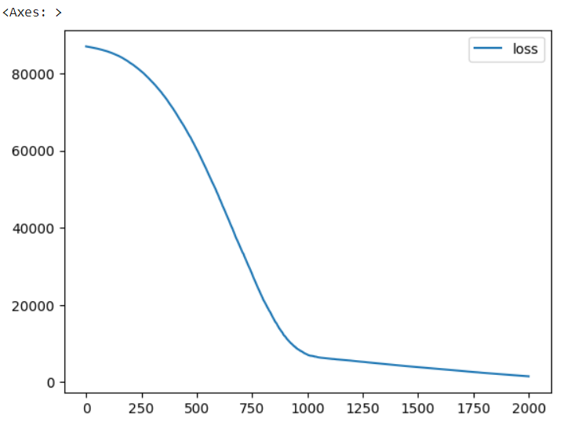
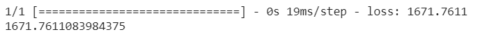
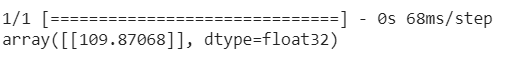

# Developing a Neural Network Regression Model

## AIM

To develop a neural network regression model for the given dataset.

## THEORY

Explain the problem statement

## Neural Network Model



## DESIGN STEPS

### STEP 1:

Loading the dataset

### STEP 2:

Split the dataset into training and testing

### STEP 3:

Create MinMaxScalar objects ,fit the model and transform the data.

### STEP 4:

Build the Neural Network Model and compile the model.

### STEP 5:

Train the model with the training data.

### STEP 6:

Plot the performance plot

### STEP 7:

Evaluate the model with the testing data.

## PROGRAM
```
from google.colab import auth
import gspread
from google.auth import default
import pandas as pd

auth.authenticate_user()
creds, _ = default()
gc = gspread.authorize(creds)

worksheet = gc.open('Neuron').sheet1
data = worksheet.get_all_values()

df = pd.DataFrame(data[1:], columns=data[0])
df = df.astype({'Input':'float'})
df = df.astype({'Output':'float'})

df.head()

x = df[['Input']].values
y = df[['Output']].values

x
y

from sklearn.model_selection import train_test_split
from sklearn.preprocessing import MinMaxScaler

from tensorflow.keras.models import Sequential
from tensorflow.keras.layers import Dense

x_train,x_test,y_train,y_test = train_test_split(x,y,test_size=0.33,random_state=33)

scalar = MinMaxScaler()

scalar.fit(x_train)

x_train1 = scalar.transform(x_train)

ai_brain = Sequential([
    Dense(7,activation='relu'),
    Dense(10,activation='relu'),
    Dense(1)
])

ai_brain.compile(optimizer = 'rmsprop', loss = 'mse')

ai_brain.fit(x_train1,y_train,epochs=2000)

loss_df = pd.DataFrame(ai_brain.history.history)
loss_df.plot()

X_test1 = scalar.transform(x_test)
ai_brain.evaluate(X_test1,y_test)

X_n1 = [[4]]
X_n1_1 = scalar.transform(X_n1)
ai_brain.predict(X_n1_1)
```

## Dataset Information


## OUTPUT

### Training Loss Vs Iteration Plot



### Test Data Root Mean Squared Error



### New Sample Data Prediction



## RESULT
Thus a neural network regression model for the given dataset is written and executed successfully.

